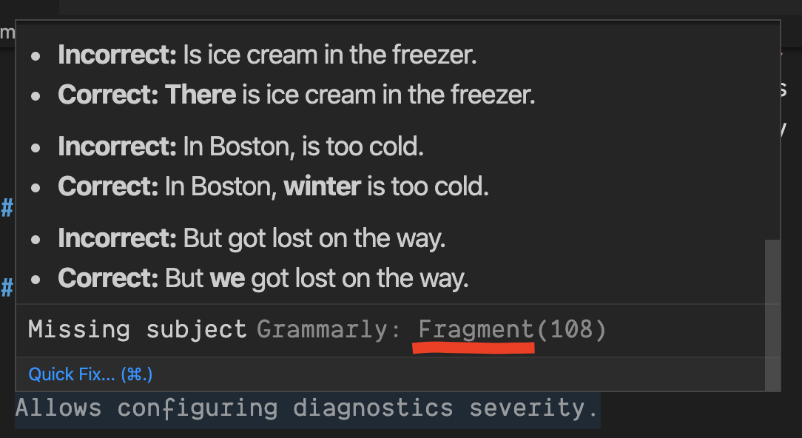
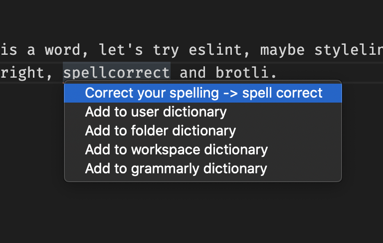

# Grammarly

Unofficial Grammarly extension.


## Using a Paid Grammarly Account

Use the `Grammarly: Login to grammarly.com` command to enter your account credentials. The command will prompt you first for username and then for a password.


## Configuring alert severity

You can assign severity levels to the Grammarly diagnostics category. To find diagnostics category name, hover on a problem in the editor. (see category name highlighted in the following example)



```json
{
  "grammarly.severity": {
    "Fragment": 2 // Sets Fragment category to Warning.
  }
}
```

### Severity Levels

| Name        | Value |
| ----------- | ----- |
| Error       | 1     |
| Warning     | 2     |
| Information | 3     |
| Hint        | 4     |

## Extension Settings

This extension contributes to the following settings:

- `grammarly.autoActivate`: Configures Grammarly activation behavior. When set to `false`, you need to run `Grammarly: Check grammar errors` to start Grammarly service.
- `grammarly.audience`: Sets the default audience for every document.
- `grammarly.dialect`: Sets the default dialect for every document.
- `grammarly.domain`: Sets the default domain for every document.
- `grammarly.emotions`: Sets the default list of emotions for every document.
- `grammarly.goals`: Sets the default list of goals for every document.
- `grammarly.userWords`: Custom word in the user dictionary.
- `grammarly.overrides`: Customize `audience`, `dialect`, `domain`, `emotions` and `goals` for specific documents.
- `grammarly.diagnostics`: Sets language-specific rules to ignore unnecessary diagnostics.
- `grammarly.severity`: Remap the severity of Grammarly alerts.

## Release Notes

### Version 0.11.0

- New languages: asciidoc and json
- Improved status bar to show extension activity and document status

### Version 0.10.0

- Opt-out automatic activation by setting `grammarly.autoActivate` to `false`.

### Version 0.9.0

- Set document goals interactively using `Grammarly: Set document goals` command.

### Version 0.8.0

- All file schemes (except `git://`) are supported.
- Diagnostics severity is now configurable.
- A detailed explanation for grammar issues is provided on hover.
- Diagnostics positions are updated on text change.

### Version 0.7.0

Using the keytar package to store user credentials in the system keychain.

### Version 0.6.0

Ignore diagnostics in regions of markdown. By default, fenced code blocks are ignored.

To ignore inline code snippets, set `grammarly.diagnostics` to:

```json
{
  "[markdown]": {
    "ignore": ["inlineCode", "code"]
  }
}
```

The `ignore` option uses node types from remark AST, you can find supported type in [this example on ASTExplorer](https://astexplorer.net/#/gist/6f869d3c43eed83a533b8146ac0f470b/latest).

### Version 0.5.0

Custom Grammarly goals per document.

### Version 0.4.0

Dismiss alerts.

### Version 0.3.0

Save words to local or Grammarly dictionary.



### Version 0.1.0

Uses incremental document sync to send operational transformation messages to Grammarly API which
gives near real-time feedback/diagnostics.

### Version 0.0.0

The initial release of unofficial Grammarly extension.

**Enjoy!**
